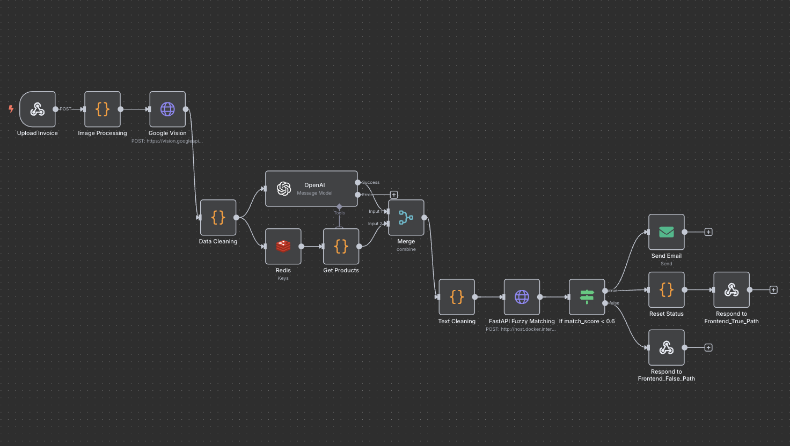

# Invoice Agent
## Description
This is a invoice matching service that leverages OCR and AI to streamline operations.
It supports seamless invoice uploads (in either image or PDF format), with a large language model (LLM) for structured data extraction.

The system uses Redis to cache the product list you want to match, and provides fuzzy matching on the fly. Users can interact through an intuitive Gradio frontend, while n8n powers a robust automation workflow.

---

## Demo Video
https://youtu.be/Pfk4DfF9nHo

---

## Project Structure
```
.
├── src/
│   ├── app.py               # Gradio Frontend Interface
│   ├── service.py           # FastAPI service for fuzzy matching
│   ├── models/              # Pydantic (validating data between APIs)
│   ├── utils/               # Utility functions (e.g. main logic of fuzzy matching)
├── Dockerfile.fastapi       # Dockerfile for fastAPI service
├── Dockerfile.gradio        # Dockerfile for Gradio app
├── docker-compose.yml       # Start the whole service
```
---

## How to Start the Service
```
docker compose up --build
```
Once the service is running, the following services will be available:
* Gradio Frontend: Access the interface at `http://localhost:7860`
* FastAPI API: `http://localhost:8000`
* n8n Workflow Designer: Manage workflows at `http://localhost:5678`
* Redis: Runs on `port 6379`

---

## Credential Setup in n8n (just in case)
There are some credentials needed to be set up beforehand because I am using external APIs (e.g., Google Vision, OpenAI). In case the n8n workflow cannot be executed as expected due to crednetial reasons, here are some instructions
1. Redis
Be sure to install Redis first. Find here for more instruction: https://redis.io/docs/latest/operate/oss_and_stack/install/archive/install-redis/
or use docker: https://hub.docker.com/_/redis

Type in the following field and value
* Host: redis
* Port: 6379

2. OpenAI
* API Key: Your OpenAI key
* Base URL: https://api.openai.com/v1

3. Google Service:
Here: https://console.cloud.google.com/iam-admin/serviceaccounts
Instructions: https://developers.google.com/workspace/guides/create-credentials
After registrating the API key, a JSON credential file will be automatically downloaded
* Service Account Email: The one from the JSON credential
* Private Key: Also from the JSON crednetial 
* Set up for use in HTTP Request node: Yes (Toggle On)
* Scope(s): https://www.googleapis.com/auth/cloud-vision

4. SMTP for Gmail
Go to https://myaccount.google.com/apppasswords to apply password
* User: your gmail
* Password: The one you applied
* Host: smtp.gmail.com
* Port: 587
* No SSL/TLS or Disabled STARTLS (Keep Toggle off)

---

## Details of n8n Workflow Design
### Part A. Upload Product List

1. **Users upload list of products either in .xlsx or .csv format**
In a typical scenario, the system would pull a product list from a database for matching. However, to prioritize convenience and flexibility, I utilize Redis for temporary caching. Users can easily upload a product list (.xlsx or .csv) through the Gradio frontend at any time, allowing the system to store “product information” in memory. This enables seamless fuzzy matching later, making the process both efficient and adaptable.
1.1. The uploading operation is performed on Gradio
1.2. The API calling, data communication, and the trigger of the workflow is in the Webhook node in n8n
2. **Webhook receive data**

3. **Data Cleaning and Storing**
The following processes were implemented to not only prevent errors from inconsistent data, but create a structured dataset optimzed for fuzzy matching.
* Filling missing values with 0
* Ensure Unit Price is Float
* Filter Empty Rows
**The code in this part is written in Python using the Code Node inside n8n**

4. **Store data in Redis**
Data is formatted and stored using k-v pair style into Redis, which is efficient for retrieval and fuzzy matching in later workflow

5. **Return the storage result by Respond to webhook**
To provide interactive experience

### Part B. Invoice OCR/LLM and Fuzzy Matching 


1. **Users upload invoice either in images or PDF format**
The upload process is decribed below
* Upload Image or PDF:
    * Supported Formats: .jpg, .png, .pdf
    * Function Triggered: Initiates the upload_invoice function to handle the uploaded file.
* Gradio Image Quality Check (via `image_checker.py`):

✅ Pass: If the image is valid (not blank or completely black), the system proceeds with processing.

❌ Fail: If the image is blank or all black, an error message is displayed, and the upload is halted.

2. **Webhook receive data**

3. **Image Processing and OCR**
In this step, JSON request containing image data (in base64 type) will be processed, and convert to another JSON format such that the service can invoke Google Vision API for OCR.
* Why Google Vision API:
    * I tried self-building API using Tesseract and EasyOCR, but failed on surpassing Google Vision in terms of accuracy, especially in Chinese characters. Therefore, I decided to use Google Vision in order to have better output so that the downstream LLM processing could also do better job on structuring the text.

4. **Data Cleaning**
Since the response JSON from Google Vision also needs to be processed so that we could use the text to feed downstream LLM, I added another Code Node here to do this job.

5. **Parallel Workflow**
Here I split the workflow into two parallel flow because I also have to get the product list from Redis to prepare for fuzzy matching
**5-1. Downstream LLM Process**
The LLM chosen was OpenAI.
I set a system prompt for the LLM to process OCR text into a structured JSON.
The original prompt is configured in Chinese, but I will also post it in English here
```
Chinese Version:
你是一位資料擷取助手，專門從中文發票或訂單文字中擷取關鍵資訊。
請根據提供的文字資料，輸出一個結構化的 JSON 格式，包含以下欄位：
- "customer_name": 顧客名稱，若無資訊請填入 null
- "order_date": 訂單日期（格式建議為 yyyy-mm-dd），若無資訊請填入null
- "items": 每個商品一筆記錄，包含：
  - "original_input": 原始的文字輸入
  - "item_name": 商品名稱，若無法判斷請填入 null
  - "quantity": 數量，若無請填入 null
  - "unit": 單位（如 斤、支、盒 等），若無請填入 null
  - "note": 其他備註，例如規格（可為 null）
請僅輸出合法的 JSON 字串，**不要加入多餘文字或解釋**。

English Version:
You are a data extraction assistant specialized in extracting key information from text found on Chinese invoices or orders.
Based on the provided text data, please output a structured JSON format containing the following fields:
- "customer_name": Customer name, if information is missing, fill with null
- "order_date": Order date (recommended format yyyy-mm-dd), if information is missing, fill with null
- "items": An array of records, one for each item, containing:
  - "original_input": The original text input for the item line
  - "item_name": Item name, if indeterminable, fill with null
  - "quantity": Quantity, if missing, fill with null
  - "unit": Unit (e.g., catty, piece, box, etc.), if missing, fill with null
  - "note": Other notes, such as specifications (can be null)
Please output only a valid JSON string. **Do not add any extra text or explanations.**
```

There are some benefits in explicitly predefining the system prompt:
* This can guarantee that the extracted data from OCR text is consistent, uniform, making it easier to integrate with other downstream processes (besides fuzzy matching).
* The prompt can instruct the LLM to use null for missing or indeterministic values, preventing extra efforts on exception handling and maintain data integrity.
* The logic is centralized and easy to update or extend.


**5-2. Redis Data Retrieval + Processing**
This main purpose of this step is to retreive product list data from Redis, and convert it into the following format that is easier for merging the result from LLM
```
{"product_list": [{item object 1}, {item object 2} ... ]}
```
6. **Merging & Cleaning Step (Post-LLM + Redis Merge)**
This step is to consolidate structured text from LLM with Redis product data.
Metadata extracted are as follows:
* customer_name: prioritizes LLM output, falls back to earlier value or default "未知客戶".
* order_date: prioritizes LLM output, falls back to earlier value or today() date.
The code also retrieves item list from structured content (items), defaults to empty list if missing. It handles optional formats like [{"index": 0, "message": {...}}] by extracting inner message.
The final output includes:
* customer_name
* order_date
* items (from LLM)
* product_list (from Redis query)

7. **Call Self-built API for Fuzzy Matching**
Since complex logic and external libraries cannot be implemented inside n8n's Code Node, so I moved the fuzzy matching process outside, leaving only HTTP Request in the workflow. How I implemented the fuzzy matching algorithm will be explained later.

To sum up this step, merged data from Step 6 will be passed to the FastAPI endpoint. The API will response the matching result between items on the invoice and the product list, with a matching score. The format will look like this
```
{
"product_id": "some id",
"matched_name": "item name inside the product list",
"original_input": "item name from the invoice",
"quantity": some number,
"unit_price": some number,
"subtotal": some number,
"match_score": matching score (between 0 to 1)
}
```
Also, this FastAPI interface will finalize the JSON that would be return to the user/frontend as per the requirement doc.

8. **Finalizing Step**
I set a if-else node here to examine all records containing matching score that is less than 0.6.
* If < 0.6 :
    * Records with matching score less than 0.6 will be extracted into an email as part of the text
    * The email was set up using SMTP with Gmail credentials.
    * status field of the JSON will be reset to "pending" (originally it was "completed")
* If > 0.6:
    * Nothing will happend to the record

Regardless there are records with matching score less than 0.6 or not, the while JSON response will be returned to the frontend (or could be further stored into a database). 

---

## The Implementation of Fuzzy Matching
Please refer the the code inside utils directory named `fuzzy_matcher.py`.
This function is responsible for comparing `item_name` on the invoice from list of products from Redis. It aims to find the best matching product for each item even when names are not identical.

1. Whitespace was removed and input `item_name` were tokensized by `jieba.cut` for later fuzzy matching. `jieb`is a library for Chinese text segmentation for improved tokenization.

2. Handle Alias: Splits the product name by `/`. This allows single product entry to have multiple names or aliases. Matching is based on alias.

3. Matching Strategies (per alias):
There are 3 matching strategies:
* Strategy 1. Exact Match:
If the incoming `item_name` is identical to the alias, then assigns a perfect score (1.0), and set this product as the `best_match` (no need to check for other alias either).

* Strategy 2. Substring Match:
Check if `item_name` is contained within the alias or vice-versa. If true, assigns a high score(0.95) and updates the `best_match`, then continues to the next alias.
-> Why 0.95? Although a substring match indicates very close semantic meaning, there could still be minor differences. To distinguish it from a perfect exact match (1.0), this slightly lower score (0.95) is used as a manually defined high confidence value.

* Strategy 3. Fuzzy Token Match:
If no exact nor partial match, then uses `rapidfuzz` to calculate the score. `rapidfuzz` is a library for fast fuzzy string matching. `fuzz` is used for calculating similarity scores (`fuzz.token_sort_ratio`). After the calculation, `best_match` will be updated according to the score found so far (update with the highest score)
-> What is `token_sort_ratio`? It is a fuzzy string matching algorithm often associated with the fuzzywuzzy library
    * It first "tokensizes and sorts" two strings
    * Then calculates their similarity based on the Levenshtein distance
    * This prevents word order from affecting the matching result, e.g.:
        *  "有機 紅蘿蔔" vs "紅蘿蔔 有機" → token_sort_ratio = 100

* Output Results:
    * Edge case: If no product is found at all, the `matched_name` will be showned as "未匹配"
    * Each comparison result will include:
        * product ID and name
        * matching confidence score
        * and other information

* Other takeaways:
    * Threshold as input: Leave a customizable input theshold to determine scores. This threshold can be useful if we want to mark certain low-score item inside the JSON (not mentioned in requirement doc though)


---
# Deliverables
* n8n Workflow: Please refer to the `n8n_workflow` directory
* n8n data: Please refer to the `n8n_data` directory
* Testing result: Please refer to `testing_result.json`
* Workflow testing: https://youtu.be/S6-xULDt368


---
# Future Work
* There is still some limitations on using Levenshtein distance to do fuzzy matching (e.g., cannot handle synonyms well, but there are lots of synonyms and variants in Chinese)
* Since **word segmentation** is quite crucial for Chinese characters, I am considering to enhance the fuzzy matching algorithm using Jieba Segmentation plus TF-IDF
* If possible, deep learning models such as mBERT could also be used.


---

# Side notes: n8n Self-Hosting Using Free Resources

### 1. Register a Render Account Using Free Tier Plan
### 2. Run an n8n Image
Registration link: docker.n8n.io/n8nio/n8n
* Open a Webservice deployment on Render.com
* Paste the link above at the input box of Image URL
* Connect and wait
### 3. Use Cron Job to keep the server running
Because the server for Free Tier plan users at Render will spin off periodically, resulting every registration on n8n to restart,
so we could utilize Cron Jon to send request regularly to keep the server from spinning off
